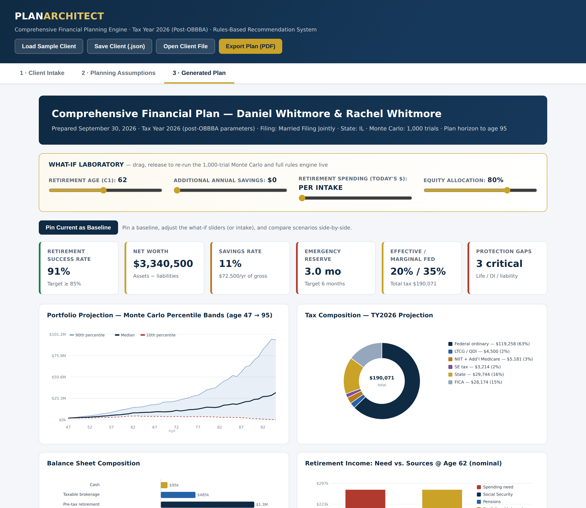
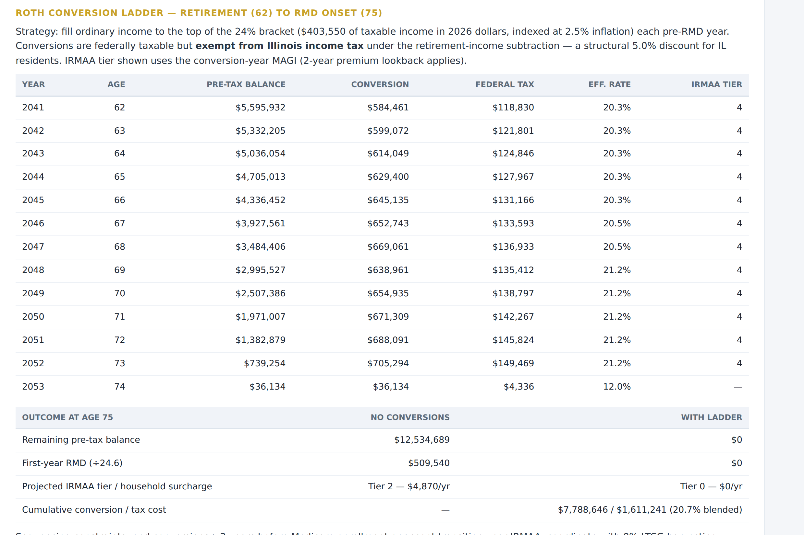
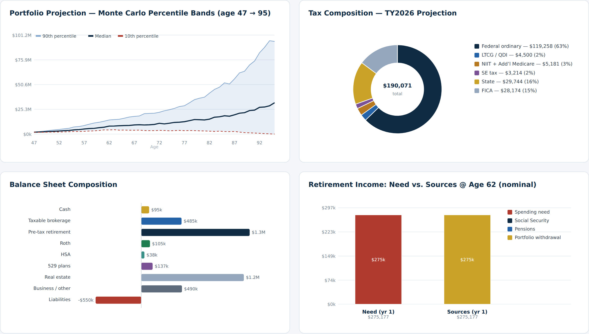
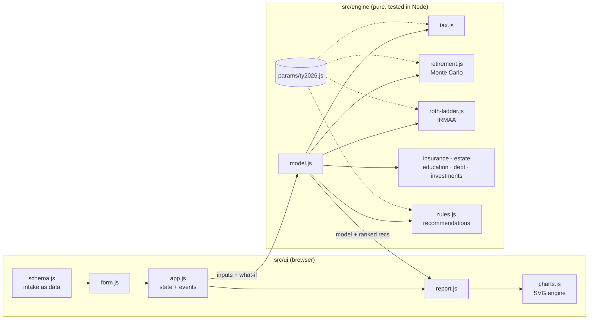

# Plan Architect — Financial Planning Engine

**A comprehensive financial planning engine that runs entirely in the browser.** Enter a household's full financial picture and get a prioritized plan in about a second. The plan covers a TY2026 tax projection, a Monte Carlo retirement analysis, a Roth conversion ladder with Medicare IRMAA modeling, and insurance, estate, education, debt and investment reviews, all ranked by a rules-based recommendation engine.

[](https://github.com/pelewis0711/Financial-Planning-Engine/actions/workflows/ci.yml)

-c9a227)

### ▶ [Try the live demo](https://pelewis0711.github.io/Financial-Planning-Engine/?demo)
The demo opens straight to a generated plan for a fictional sample household. Drag the what-if sliders to re-run the simulation live.



---

## What it does

| Domain | What the engine computes |
|---|---|
| **Tax** | Full 2026 federal projection: ordinary brackets, LTCG/QDI stacking, NIIT, Additional Medicare, self-employment tax, §199A QBI with the SSTB phase-out, AMT, the child tax credit, the OBBBA senior deduction and SALT cap phase-down, plus Illinois tax. Also reports marginal/effective rates, headroom left in the 24% bracket, and unused 0% capital-gains room. |
| **Retirement** | Deterministic projection plus a **1,000-trial Monte Carlo** (lognormal returns, glide path from accumulation to decumulation, Social Security claiming-age adjustments). Also covers contribution capacity including SECURE 2.0 catch-ups, backdoor and mega-backdoor Roth eligibility, the pro-rata rule, and RMD onset by birth year. |
| **Roth ladder + IRMAA** | Year-by-year conversions filling the 24% bracket from retirement until RMDs begin, with inflation-indexed brackets. Shows the first RMD and Medicare **IRMAA** cliff tier with and without the ladder. |
| **Insurance** | Capital-needs life insurance analysis, disability income gap, umbrella liability vs. net worth, and long-term-care exposure. |
| **Estate** | Federal and **Illinois** (non-portable) estate tax exposure, missing documents, guardianship and beneficiary gaps, and annual-exclusion gifting capacity. |
| **Education, debt, investments** | 529 funding gaps on an age-based glide path; debt avalanche ordering against an after-tax investment hurdle; target allocation vs. current, concentration, and a stated-vs-behavioral risk tolerance check. |
| **Recommendations** | About 60 planning rules produce findings that are scored, prioritized (high/med/low), and quantified. The top ten become the executive summary's action agenda. |

**Interactive what-if lab.** Change the retirement age, extra savings, spending or allocation and the whole plan re-runs. Pin a baseline to compare scenarios side by side. Scenarios share the same simulated market paths ([common random numbers](#reproducible-monte-carlo)), so the difference you see comes from the decision you changed, not from simulation noise.

<p align="center">
  
  
</p>

## Engineering highlights

- **Pure calculation engine, separate from the UI.** `src/engine/` has no DOM access. The same code runs in the browser and in the Node test suite.
- **All tax parameters live in one audited file.** Every 2026 dollar figure is in [`src/engine/params/ty2026.js`](src/engine/params/ty2026.js), with sources cited. Rolling to 2027 means editing that file, not the logic.
- **53 unit tests with zero dependencies** (`node:test`). They cover bracket math, phase-outs, Social Security claiming rules, IRMAA cliffs, Roth-ladder invariants, Monte Carlo properties, rule triggers, and HTML escaping. CI runs them on Node 20 and 22, and GitHub Pages only deploys if they pass.
- <a id="reproducible-monte-carlo"></a>**Reproducible Monte Carlo.** The simulation uses a seeded PRNG (Mulberry32) with Box–Muller normals instead of `Math.random`, so results are testable and what-if comparisons are apples to apples.
- **Schema-driven intake.** The 150-field intake and assumptions form is declared once as data. The form, JSON save/load, and test fixtures are all generated from it.
- **Custom SVG chart engine.** Line charts with percentile bands, donut, bar and stacked charts with tooltips, built without a charting library.
- **Private by design.** Everything runs client-side, and no client data ever leaves the browser.

## Architecture



```
index.html
src/
  engine/            calculation engine (no DOM)
    params/ty2026.js   every 2026 tax & benefit parameter, with sources
    model.js           assembles all domains into one model
    tax.js  retirement.js  roth-ladder.js  insurance.js  estate.js
    education.js  debt.js  investments.js  cashflow.js  assumptions.js
    rules.js           recommendation rules, one function per domain
    random.js          seeded PRNG + Gaussian draws
  ui/                schema-driven form, report renderer, SVG charts, app shell
tests/               node:test suites
examples/            sample client file (loadable via "Open Client File")
docs/                methodology and screenshots
```

## Run it locally

No build step and nothing to install. The app uses ES modules, so serve it over HTTP instead of opening the file directly:

```bash
git clone https://github.com/pelewis0711/Financial-Planning-Engine.git
cd Financial-Planning-Engine
npm start          # python3 -m http.server 8080 → http://localhost:8080/?demo
npm test           # requires Node 20+
```

## Methodology

A summary is below. The full write-up, including assumptions and known simplifications, is in [docs/methodology.md](docs/methodology.md).

- **Tax:** IRS Rev. Proc. 2025-32 and Notice 2025-67 (post-OBBBA), plus the CMS 2026 Part B/IRMAA fact sheet.
- **Monte Carlo:** lognormal annual returns from a two-asset equity/fixed-income mix (ρ = 0.15). Accumulation uses the current allocation; decumulation uses the retirement allocation. A trial fails in the first year the portfolio is exhausted.
- **Roth ladder:** each year converts up to the top of the 24% bracket, indexed at the inflation assumption. The conversion tax is marginal bracket arithmetic.

## About

Built by **Parker Lewis**, an Agricultural & Consumer Economics student in the Financial Planning concentration at the University of Illinois Urbana-Champaign. I built it to put what I was learning in coursework (retirement needs analysis, qualified plans, tax and estate planning) into a tool that works end to end.

## Disclaimer

Plan Architect is an educational project. Its output is a planning estimate and is **not tax, legal, or investment advice**. The sample household is fictional.

## License

[MIT](LICENSE)
